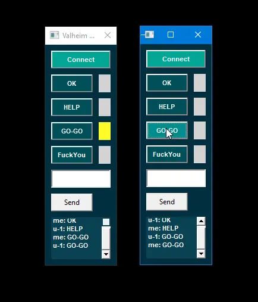

# V-connect (desktop-app)

### Video preview:

### Server repository:
https://github.com/ghstd/v_connect

### Description:
Application for pc, allows two clients to communicate via web server, transmit signals using keyboard, has small chat, supports only one session.

### Resources used:
- https://render.com

[Run server](https://v-connect-q36m.onrender.com) - wait until the server wakes up.
